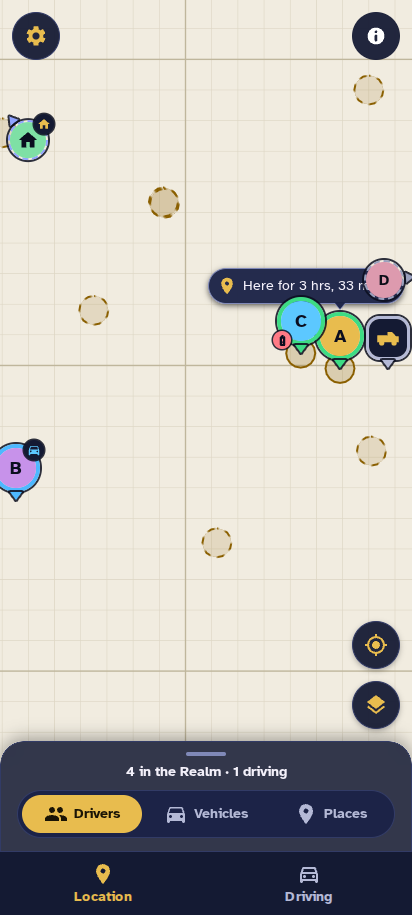
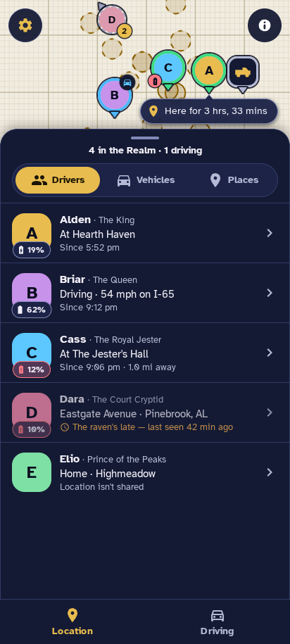
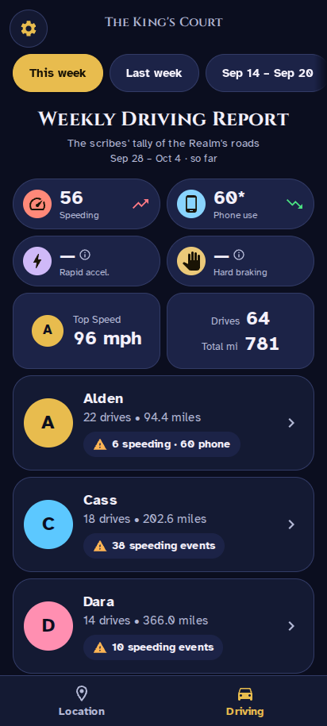
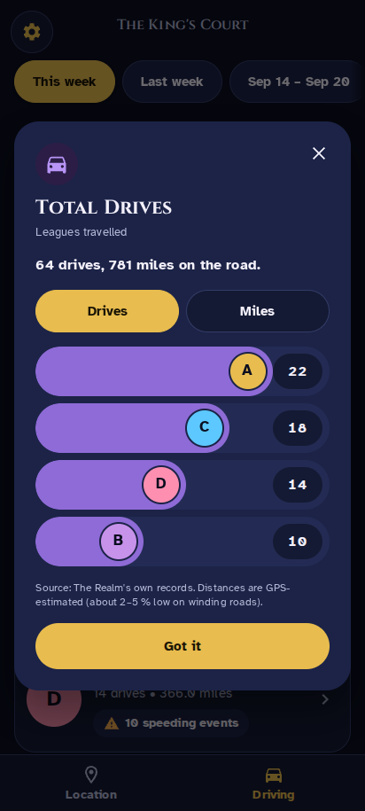
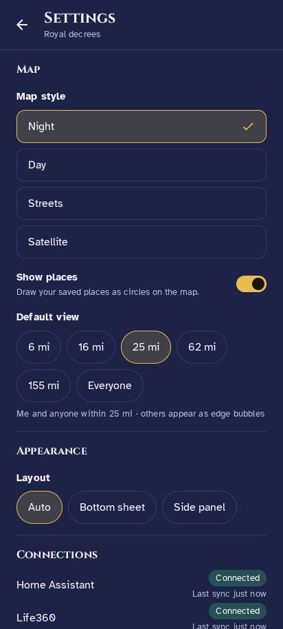

# HA360 — The Realm

A map-first family locator that runs as a Home Assistant add-on. It works with Home Assistant's Life360 integration
and the Home Assistant companion app.

Status: experimental. [realm/CHANGELOG.md](realm/CHANGELOG.md) lists what each version contains and what it does not
do yet.

## Screenshots

<table>
  <tr>
    <td align="center"> Location</td>
    <td align="center"> Drivers sheet</td>
    <td align="center"> Weekly Driving report</td>
  </tr>
  <tr>
    <td align="center"> Statistic popup</td>
    <td align="center"> Settings</td>
    <td align="center"> Unfolded phone</td>
  </tr>
</table>

Every screenshot shows Demo mode: an invented family on a frozen clock, drawn on the app's own offline demo map style,
so no real person, place or map data appears in them.

## Install

The Realm is a Home Assistant add-on (newer releases of Home Assistant call add-ons apps), so it needs an installation
that has the Supervisor (Home Assistant OS or Supervised) on an amd64 machine.

1. **Add the repository.** In Home Assistant open **Settings -> Apps -> Install app**, open the menu (three dots),
   choose **Repositories**, paste `https://github.com/Versile2/ha360` exactly and press **Add**. Close the dialog and
   reload the page if the store does not list the app yet.
2. **Install.** Open **The Realm** in the store and press **Install**. The Supervisor pulls the image
   `ghcr.io/versile2/ha360` (see the registry note below).
3. **Choose Demo mode first.** Before the first start open the app's **Configuration** tab, switch on **Demo mode**
   (`demo_mode: true` if you edit as YAML) and save. Nothing else needs to be filled in: the member, vehicle and place
   lists ship empty.
4. **Start and open it.** Press **Start**, switch on **Show in sidebar** (Home Assistant keeps this as a per-install
   setting, so the app cannot do it for you; **Watchdog** is optional) and open **The Realm** from the sidebar, the
   entry with the crown icon. It also opens in the Home Assistant companion app. You should see the invented family on
   the map and a Driving report; that confirms the install works before any real data is involved.
5. **Switch to your own household.** Turn **Demo mode** off. Then fill in the **Household members**, vehicles and places
   lists of the Configuration tab (an example with an invented cast is in
   [docs/ARCHITECTURE.md](docs/ARCHITECTURE.md#configuration)), and restart the app, because options are read when it
   starts. Your names, entity ids and addresses stay in these options on your own Home Assistant. They are never part of
   this repository or the image.

The app's own **Documentation** tab ([realm/DOCS.md](realm/DOCS.md)) covers where the data comes from, what is stored
and where, the phone-use statistic and troubleshooting.

**Registry note.** The image is a package on the GitHub Container Registry, `ghcr.io/versile2/ha360:<version>`, and it
can be private until the owner of the repository makes it public. While it is private, Home Assistant cannot pull it and
the installation fails with a pull error (for example `unauthorized` or `denied` in the Supervisor log). In that case
either wait until the package is public, or give your Home Assistant a registry login for `ghcr.io` (a GitHub account
name and a token that may read packages).

## Build

- .NET 10 SDK (see `global.json`): `dotnet build Realm.slnx` and `dotnet test Realm.slnx`.
- CI: `.github/workflows/ci.yml`. Every run publishes a summary to the `ci-artifacts` branch; see `tools/ci/README.md`.
- Releases: pushing a tag `vMAJOR.MINOR.PATCH` runs `.github/workflows/release.yml`. It refuses a tag that differs from
  `version` in `realm/config.yaml` or has no `## MAJOR.MINOR.PATCH` section in `realm/CHANGELOG.md`, then builds the
  image and pushes `ghcr.io/versile2/ha360:<version>` (never `latest`).

## Licence

The Realm is released under the MIT licence ([LICENSE](LICENSE)). The components it bundles or fetches, and the
licences and credits they ask for, are listed in [THIRD-PARTY-NOTICES.md](THIRD-PARTY-NOTICES.md). The image carries
both files in `/app`.

## Trademarks

The Realm is an independent, unofficial project. It is not affiliated with, endorsed by or sponsored by Life360, Inc.,
the Open Home Foundation or Nabu Casa. Life360 is a trademark of Life360, Inc. Home Assistant names and logos belong
to their owners. These names are used only to say what the app works with.
